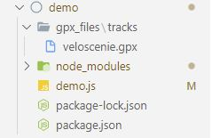
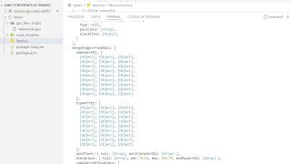

[](https://nodejs.org/en/about/releases/)
[](https://nodejs.org/en/about/releases/)
[](https://nodejs.org/en/about/releases/)
[](https://nodejs.org/en/about/releases/)
[](https://nodejs.org/en/about/releases/)
[](https://www.gnu.org/licenses/gpl-3.0.html)
[](https://www.topografix.com/gpx.asp)
[](https://github.com/delphinbock/extract-gpx-data-delf01/blob/main/README.md)

Node module that extract data from gpx file and returns a data JSON object.

You can report issues related to the module: [issues](https://github.com/delphinbock/extract-gpx-data-delf01/issues)

## Installation

1. Add the package to your project's node_modules directory

NPM

```shell
npm i extract-gpx-data-delf01
```

Yarn

```shell
yarn add extract-gpx-data-delf01
```

PNPM

```shell
pnpm add extract-gpx-data-delf01
```

Bun

```shell
bun install extract-gpx-data-delf01
```

2. Create a gpx files directory at the root of the application.  
   For example, create a directory named "gpx_files" and/or a subdirectory named "tracks".

   

3. Put gpx files in this directory or subdirectory.  
   Multiple tracks gpx file example: [multiple tracks gpx file](https://github.com/delphinbock/gpx_veloscenie/blob/main/veloscenie.gpx)  
   Complete gpx file to test data extraction: [test gpx file](https://github.com/delphinbock/test_gpx_files/blob/main/test.gpx)
4. Use the following code. Write the path name of the gpx files folder like in the code's example.  
   For examples: "directory/subdirectory/gpxName.gpx" or "directory/gpxName.gpx".

`The second parameter is an boolean allowing to activate the integrated debug mode.`

```javascript
import { DataExtractionProps } from "./types/gpsLibType";

const runFunction = async () => {
  // Get gpx data file
  const gpxData = await extractGpxData("./gpx_files/test.gpx", false);

  return gpxData;
};

runFunction();
```

## Video installation

[](https://www.youtube.com/watch?v=DbIJi81ico4)

## Explanation

You can use a gpx file containing a single track or multiple tracks.  
The returned object contains the metadata of the gpx file (gpxFileMetadata), the information on each of the routes (routes), the information on each of the tracks (stagesTrackData), the information of all way points (wayPoints), the information of all the merged tracks (mergeStagesTrackData).  
The main information extracted from the gpx file are the metadata, distances (meter, yard), elevations, positions, types of tracks, maximum and minimum altitudes, names of the tracks.  
Url for gpx file details: [gpx files](https://www.topografix.com/GPX/1/1/)  

## Example returned object of gpx data in json format

```javascript
{
    gpxFileMetadata: {
        gpxFileCreatorName: 'delf01',
        gpxFileName: 'Veloscenie',
        gpxFileDescription: 'Veloscenie Route gpx file containing stages',
        gpxFileAuthorName: 'Delphin Bock',
        gpxFileCopyright: 'GNU General Public License',
        gpxFileCreationDatetime: '2022-02-01 23:36:36',
        gpxFileKeywords: 'veloscenie, velo, gps, gpx, stages, track',
        gpxFileExtensions: '<myns:town>Some town here</myns:town>',
        gpxFileBounds: {
            minlat: 42.960882000,
            minlon: 0.089178000,
            maxlat: 42.968482000,
            maxlon: 0.101709000
        },
        gpxFileLink: {
            href: 'https://mywebsite.com',
            text: 'My Website',
            type: 'cycling'
        }
    },
    wayPoints: [
        {
            id: 1,
            name: 'Veloscenie\'s stage',
            position: { lat: 48.855337, lon: 2.345867 },
            elevation: 633.7,
            time: '2022-02-09 22:05:00',
            magvar: -16.2,
            geoidheight: -16.2,
            cmt: 'Carrouge\'s castle',
            desc: 'Carrouge\'s castle is a 18th century red castle',
            src: 'Garmin eTrex Venture',
            url: 'https://www.veloscenie.com/',
            urlname: 'Visit Carrouge\'s castle website',
            sym: 'Scenic Area',
            type: 'monument',
            fix: '2d',
            sat: 8,
            hdop: 1.4,
            vdop: 3.2,
            pdop: 3.2,
            ageofdgpsdata: 21,
            dgpsid: 142,
            extensions: '<ogr:id>17</ogr:id><ogr:longitude>10.684415</ogr:longitude><ogr:latitude>53.865650</ogr:latitude>',
            speed: 4.23,
            course: 45.2,
            link: {
                href: 'https://mywebsite.com',
                text: 'My Website',
                type: 'cycling'
            }
        },
        {
            id: 2,
            name: 'Veloscenie\'s stage',
            position: { lat: 48.855347, lon: 2.345858 },
            elevation: 144.7,
            time: '2022-02-10 14:05:00',
            magvar: -14.2,
            geoidheight: -18.2,
            cmt: 'Mont Saint-Michel',
            desc: 'Mont Saint-Michel is a french monument',
            src: 'Garmin eTrex Venture',
            url: 'https://www.ot-montsaintmichel.com/',
            urlname: 'Visit Mont Saint-Michel website',
            sym: 'Scenic Area',
            type: 'monument',
            fix: '2d',
            sat: 6,
            hdop: 1.2,
            vdop: 3.0,
            pdop: 3.0,
            ageofdgpsdata: 20,
            dgpsid: 141,
            extensions: '<ogr:id>17</ogr:id><ogr:longitude>10.684415</ogr:longitude><ogr:latitude>53.865650</ogr:latitude>',
            speed: 4.23,
            course: 45.2,
            link: {
                href: 'https://mywebsite.com',
                text: 'My Website',
                type: 'cycling'
            }
        }
    ],
    routes: [
        {
            id: 0,
            name: 'route name',
            type: 'cycling',
            cmt: 'easy route',
            desc: 'great route in wild landscape',
            src: 'Garmin eTrex Venture',
            url: 'https://www.ot-montsaintmichel.com/',
            urlname: 'Visit Mont Saint-Michel website',
            number: '0',
            link: {
                href: 'https://mywebsite.com',
                text: 'My Website',
                type: 'cycling'
            },
            extensions: '<ogr:id>17</ogr:id><ogr:longitude>10.684415</ogr:longitude><ogr:latitude>53.865650</ogr:latitude>',
            distance: {
                meters: 15483,
                yards: 9.620
            },
            elevations: {
                full: [
                    50.4, 50.42, 50.46, 50.55, 50.66, 50.75,
                    51.08, 51.22, 51.19, 51.49, 51.42, 50.73,
                    51.22,  51.9, 53.05, 54.55, 55.96, 57.28,
                    59.63, 59.95, 60.41, 60.87, 61.46, 62.06,
                    62.86,  62.6, 62.21, 62.13, 62.05, 61.96,
                    62.7, 62.84, 63.03, 63.32, 63.57, 63.79
                ],
                min: 22.4,
                max 633.7,
                cumulativePositiveElevation: 567.6,
                cumulativeNegativeElevation: -345.6
            },
            positions: {
                positionsArrObj: [
                    { lat: 48.855337, lon: 2.345867 },
                    { lat: 48.852936, lon: 2.343239 },
                    { lat: 48.853162, lon: 2.343176 },
                    { lat: 48.853212, lon: 2.343104 }
                ],
                positionsArrArr: [
                    [48.855337, 2.345867],
                    [48.852936, 2.343239],
                    [48.853162, 2.343176]
                ]
            },
            times: {
                full: ['2022-02-02', '2022-02-03', '2022-02-03']
            },
            magvars: {
                full: ['-16.2', '-16.2', '-16.2']
            },
            geoidheights: {
                full: ['-16.2', '-16.2', '-16.2']
            },
            names: {
                full: ['DAVISTRAIL', 'DAVISTRAIL', null]
            },
            cmts: {
                full: ['MT WASHINGTON', 'MT WASHINGTON', null]
            },
            descs: {
                full: ['Junction with Davis Trail', 'Junction with Davis Trail', null]
            },
            srcs: {
                full: ['Garmin eTrex Venture', 'Garmin eTrex Venture', null]
            },
            urls: {
                full: ['www.mountwashington.org', 'www.mountwashington.org', null]
            },
            urlnames: {
                full: ['Visit my New Hampshire hiking website!', 'Visit my New Hampshire hiking website!', null]
            },
            syms: {
                full: ['Scenic Area', 'Scenic Area', null]
            },
            types: {
                full: ['cycling', 'cycling', null]
            },
            fixs: {
                full: ['2d', '2d', null]
            },
            sats: {
                full: ['8', '8', null]
            },
            hdops: {
                full: ['1.4', '1.4', null]
            },
            vdops: {
                full: ['3.2', '3.2', null]
            },
            pdops: {
                full: ['1.4', '1.4', null]
            },
            ageofdgpsdatas: {
                full: ['21', '21', null]
            },
            dgpsids: {
                full: ['142', '142', null]
            },
            extensionss: {
                full: ['<ogr:id>17</ogr:id><ogr:longitude>10.684415</ogr:longitude><ogr:latitude>53.865650</ogr:latitude>', '<wptx1:WaypointExtension><wptx1:Samples>4</wptx1:Samples></wptx1:WaypointExtension>', null]
            },
            speeds: {
                full: ['4.23', '4.23', null]
            },
            courses: {
                full: ['45.2', '45.2', null]
            }
        },
        {
            id: 1,
            name: 'Alençon route',
            type: 'cycling',
            cmt: 'hard route',
            desc: 'in city',
            src: 'Garmin eTrex Venture',
            url: 'https://www.alencon.com/',
            urlname: 'Visit Alençon website',
            number: '1',
            link: {
                href: 'https://mywebsite.com',
                text: 'My Website',
                type: 'cycling'
            },
            extensions: '<ogr:id>17</ogr:id><ogr:longitude>10.684415</ogr:longitude><ogr:latitude>53.865650</ogr:latitude>',
            distance: {
                meters: 15483,
                yards: 9.620
            },
            elevations: {
                full: [
                    50.4, 50.42, 50.46, 50.55, 50.66, 50.75,
                    51.08, 51.22, 51.19, 51.49, 51.42, 50.73,
                    51.22,  51.9, 53.05, 54.55, 55.96, 57.28,
                    59.63, 59.95, 60.41, 60.87, 61.46, 62.06,
                    62.86,  62.6, 62.21, 62.13, 62.05, 61.96,
                    62.7, 62.84, 63.03, 63.32, 63.57, 63.79
                ],
                min: 22.4,
                max 633.7,
                cumulativePositiveElevation: 567.6,
                cumulativeNegativeElevation: -345.6
            },
            positions: {
                positionsArrObj: [
                    { lat: 48.855337, lon: 2.345867 },
                    { lat: 48.852936, lon: 2.343239 },
                    { lat: 48.853162, lon: 2.343176 },
                    { lat: 48.853212, lon: 2.343104 }
                ],
                positionsArrArr: [
                    [48.855337, 2.345867],
                    [48.852936, 2.343239],
                    [48.853162, 2.343176]
                ]
            },
            times: {
                full: ['2022-02-02', '2022-02-03', '2022-02-03']
            },
            magvars: {
                full: ['-16.2', '-16.2', '-16.2']
            },
            geoidheights: {
                full: ['-16.2', '-16.2', '-16.2']
            },
            names: {
                full: ['DAVISTRAIL', 'DAVISTRAIL', null]
            },
            cmts: {
                full: ['MT WASHINGTON', 'MT WASHINGTON', null]
            },
            descs: {
                full: ['Junction with Davis Trail', 'Junction with Davis Trail', null]
            },
            srcs: {
                full: ['Garmin eTrex Venture', 'Garmin eTrex Venture', null]
            },
            urls: {
                full: ['www.mountwashington.org', 'www.mountwashington.org', null]
            },
            urlnames: {
                full: ['Visit my New Hampshire hiking website!', 'Visit my New Hampshire hiking website!', null]
            },
            syms: {
                full: ['Scenic Area', 'Scenic Area', null]
            },
            types: {
                full: ['cycling', 'cycling', null]
            },
            fixs: {
                full: ['2d', '2d', null]
            },
            sats: {
                full: ['8', '8', null]
            },
            hdops: {
                full: ['1.4', '1.4', null]
            },
            vdops: {
                full: ['3.2', '3.2', null]
            },
            pdops: {
                full: ['1.4', '1.4', null]
            },
            ageofdgpsdatas: {
                full: ['21', '21', null]
            },
            dgpsids: {
                full: ['142', '142', null]
            },
            extensionss: {
                full: ['<ogr:id>17</ogr:id><ogr:longitude>10.684415</ogr:longitude><ogr:latitude>53.865650</ogr:latitude>', '<wptx1:WaypointExtension><wptx1:Samples>4</wptx1:Samples></wptx1:WaypointExtension>', null]
            },
            speeds: {
                full: ['4.23', '4.23', null]
            },
            courses: {
                full: ['45.2', '45.2', null]
            }
        }
    ],
    stagesTrackData : [
        {
            id: 0,
            name: 'Paris / Massy',
            type: 'cycling',
            cmt: 'gps track comment',
            desc: 'description of the track',
            src: 'source of the trackpoint data',
            url: 'URL associated with the track',
            urlname: 'text to display on the hyperlink',
            number: 1,
            link: {
                href: 'https://mywebsite.com',
                text: 'My Website',
                type: 'cycling'
            },
            extensions: '<ogr:id>17</ogr:id><ogr:longitude>10.684415</ogr:longitude><ogr:latitude>53.865650</ogr:latitude>',
            distance: {
                meters: 15483,
                yards: 9.620
            },
            elevations: {
                full: [
                    50.4, 50.42, 50.46, 50.55, 50.66, 50.75,
                    51.08, 51.22, 51.19, 51.49, 51.42, 50.73,
                    51.22,  51.9, 53.05, 54.55, 55.96, 57.28,
                    59.63, 59.95, 60.41, 60.87, 61.46, 62.06,
                    62.86,  62.6, 62.21, 62.13, 62.05, 61.96,
                    62.7, 62.84, 63.03, 63.32, 63.57, 63.79
                ],
                min: 22.4,
                max 633.7,
                cumulativePositiveElevation: 567.6,
                cumulativeNegativeElevation: -345.6
            },
            positions: {
                positionsArrObj: [
                    { lat: 48.855337, lon: 2.345867 },
                    { lat: 48.852936, lon: 2.343239 },
                    { lat: 48.853162, lon: 2.343176 },
                    { lat: 48.853212, lon: 2.343104 }
                ],
                positionsArrArr: [
                    [48.855337, 2.345867],
                    [48.852936, 2.343239],
                    [48.853162, 2.343176]
                ]
            },
            times: {
                full: ['2022-02-02', '2022-02-03', '2022-02-03']
            },
            magvars: {
                full: ['-16.2', '-16.2', '-16.2']
            },
            geoidheights: {
                full: ['-16.2', '-16.2', '-16.2']
            },
            names: {
                full: ['DAVISTRAIL', 'DAVISTRAIL', null]
            },
            cmts: {
                full: ['MT WASHINGTON', 'MT WASHINGTON', null]
            },
            descs: {
                full: ['Junction with Davis Trail', 'Junction with Davis Trail', null]
            },
            srcs: {
                full: ['Garmin eTrex Venture', 'Garmin eTrex Venture', null]
            },
            urls: {
                full: ['www.mountwashington.org', 'www.mountwashington.org', null]
            },
            urlnames: {
                full: ['Visit my New Hampshire hiking website!', 'Visit my New Hampshire hiking website!', null]
            },
            syms: {
                full: ['Scenic Area', 'Scenic Area', null]
            },
            types: {
                full: ['cycling', 'cycling', null]
            },
            fixs: {
                full: ['2d', '2d', null]
            },
            sats: {
                full: ['8', '8', null]
            },
            hdops: {
                full: ['1.4', '1.4', null]
            },
            vdops: {
                full: ['3.2', '3.2', null]
            },
            pdops: {
                full: ['1.4', '1.4', null]
            },
            ageofdgpsdatas: {
                full: ['21', '21', null]
            },
            dgpsids: {
                full: ['142', '142', null]
            },
            extensionss: {
                full: ['<ogr:id>17</ogr:id><ogr:longitude>10.684415</ogr:longitude><ogr:latitude>53.865650</ogr:latitude>', '<wptx1:WaypointExtension><wptx1:Samples>4</wptx1:Samples></wptx1:WaypointExtension>', null]
            },
            speeds: {
                full: ['4.23', '4.23', null]
            },
            courses: {
                full: ['45.2', '45.2', null]
            }
        },
       {
            id: 1,
            name: 'Massy / Versailles',
            type: 'cycling',
            cmt: 'gps track comment',
            desc: 'description of the track',
            src: 'source of the trackpoint data',
            url: 'URL associated with the track',
            urlname: 'text to display on the hyperlink',
            number: 1,
            link: {
                href: 'https://mywebsite.com',
                text: 'My Website',
                type: 'cycling'
            },
            distance: {
                meters: 15483,
                yards: 9.620
            },
            elevations: {
                full: [
                    50.4, 50.42, 50.46, 50.55, 50.66, 50.75,
                    51.08, 51.22, 51.19, 51.49, 51.42, 50.73,
                    51.22,  51.9, 53.05, 54.55, 55.96, 57.28,
                    59.63, 59.95, 60.41, 60.87, 61.46, 62.06,
                    62.86,  62.6, 62.21, 62.13, 62.05, 61.96,
                    62.7, 62.84, 63.03, 63.32, 63.57, 63.79
                ],
                min: 22.4,
                max 633.7,
                cumulativePositiveElevation: 567.6,
                cumulativeNegativeElevation: -345.6
            },
            positions: {
                positionsArrObj: [
                    { lat: 48.855337, lon: 2.345867 },
                    { lat: 48.852936, lon: 2.343239 },
                    { lat: 48.853162, lon: 2.343176 },
                    { lat: 48.853212, lon: 2.343104 }
                ],
                positionsArrArr: [
                    [48.855337, 2.345867],
                    [48.852936, 2.343239],
                    [48.853162, 2.343176]
                ]
            },
            times: {
                full: ['2022-02-02', '2022-02-03', '2022-02-03']
            },
            magvars: {
                full: ['-16.2', '-16.2', '-16.2']
            },
            geoidheights: {
                full: ['-16.2', '-16.2', '-16.2']
            },
            names: {
                full: ['DAVISTRAIL', 'DAVISTRAIL', null]
            },
            cmts: {
                full: ['MT WASHINGTON', 'MT WASHINGTON', null]
            },
            descs: {
                full: ['Junction with Davis Trail', 'Junction with Davis Trail', null]
            },
            srcs: {
                full: ['Garmin eTrex Venture', 'Garmin eTrex Venture', null]
            },
            urls: {
                full: ['www.mountwashington.org', 'www.mountwashington.org', null]
            },
            urlnames: {
                full: ['Visit my New Hampshire hiking website!', 'Visit my New Hampshire hiking website!', null]
            },
            syms: {
                full: ['Scenic Area', 'Scenic Area', null]
            },
            types: {
                full: ['cycling', 'cycling', null]
            },
            fixs: {
                full: ['2d', '2d', null]
            },
            sats: {
                full: ['8', '8', null]
            },
            hdops: {
                full: ['1.4', '1.4', null]
            },
            vdops: {
                full: ['3.2', '3.2', null]
            },
            pdops: {
                full: ['1.4', '1.4', null]
            },
            ageofdgpsdatas: {
                full: ['21', '21', null]
            },
            dgpsids: {
                full: ['142', '142', null]
            },
            extensionss: {
                full: ['<ogr:id>17</ogr:id><ogr:longitude>10.684415</ogr:longitude><ogr:latitude>53.865650</ogr:latitude>', '<wptx1:WaypointExtension><wptx1:Samples>4</wptx1:Samples></wptx1:WaypointExtension>', null]
            },
            speeds: {
                full: ['4.23', '4.23', null]
            },
            courses: {
                full: ['45.2', '45.2', null]
            }
        }
    ],
    mergeStagesTrackData: {
        namesArrObj: [
            { id: 0, name: 'Paris / Massy' },
            { id: 1, name: 'Massy / Versailles' },
            { id: 2, name: 'Versailles / St-Rémy-lès-Chevreuse' },
            { id: 3, name: 'St-Rémy-lès-Chevreuse / Rambouillet' },
            { id: 4, name: 'Massy / Limours' }
        ],
        typeArrObj: [
            { id: 0, type: 'cycling' },
            { id: 1, type: null },
            { id: 2, type: null },
            { id: 3, type: null },
            { id: 4, type: null },
            { id: 5, type: null }
        ],
        cmtArrObj: [
            { id: 0, cmt: 'watch out for bears' },
            { id: 1, cmt: null },
            { id: 2, cmt: null },
            { id: 3, cmt: null },
            { id: 4, cmt: null },
            { id: 5, cmt: null }
        ],
        descArrObj: [
            { id: 0, desc: 'wild landscape' },
            { id: 1, desc: null },
            { id: 2, desc: null },
            { id: 3, desc: null },
            { id: 4, desc: null },
            { id: 5, desc: null }
        ],
        srcArrObj: [
            { id: 0, src: 'Garmin eTrex Venture' },
            { id: 1, src: null },
            { id: 2, src: null },
            { id: 3, src: null },
            { id: 4, src: null },
            { id: 5, src: null }
        ],
        urlArrObj: [
            { id: 0, url: 'http://www.mysite.com' },
            { id: 1, url: null },
            { id: 2, url: null },
            { id: 3, url: null },
            { id: 4, url: null },
            { id: 5, url: null }
        ],
        urlnameArrObj: [
            { id: 0, urlname: 'My website' },
            { id: 1, urlname: null },
            { id: 2, urlname: null },
            { id: 3, urlname: null },
            { id: 4, urlname: null },
            { id: 5, urlname: null }
        ],
        numberArrObj: [
            { id: 0, number: 5 },
            { id: 1, number: null },
            { id: 2, number: null },
            { id: 3, number: null },
            { id: 4, number: null },
            { id: 5, number: null }
        ],
        linkArrObj: [
            { id: 0, link: { <link href="https://mywebsite.com"><text>My Website</text><type>cycling</type></link> },
            { id: 1, link: null },
            { id: 2, link: null },
            { id: 3, link: null },
            { id: 4, link: null },
            { id: 5, link: null }
        ],
        distances: {
            full: { meters: 490414, yards: 536323 },
            distancesArrObj: [
                { id: 1, distance: { meters: 17053, yards: 18649 } },
                { id: 2, distance: { meters: 23412, yards: 25603 } }
            ],
        },
        positions: {
            full: [
                { lat: 48.855337, lon: 2.345867 },
                { lat: 48.852936, lon: 2.343239 },
                { lat: 48.853162, lon: 2.343176 },
                { lat: 48.853212, lon: 2.343104 },
                { lat: 48.853243, lon: 2.342966 },
                { lat: 48.853265, lon: 2.342826 },
                { lat: 48.853284, lon: 2.342684 },
                { lat: 48.853298, lon: 2.342542 },
                { lat: 48.853307, lon: 2.342398 },
                { lat: 48.853334, lon: 2.34199 },
                { lat: 48.853354, lon: 2.341581 }
            ],
            positionsArrObj: [
                {
                    id: 25,
                    positions: [
                        { lat: 48.735693, lon: 2.238397 },
                        { lat: 48.735749, lon: 2.238334 },
                        { lat: 48.735771, lon: 2.238351 },
                        { lat: 48.735827, lon: 2.238408 },
                        { lat: 48.735859, lon: 2.238421 },
                        { lat: 48.735926, lon: 2.238449 },
                        { lat: 48.73606, lon: 2.238444 },
                        { lat: 48.736166, lon: 2.23836 },
                        { lat: 48.736229, lon: 2.23827 },
                        { lat: 48.736297, lon: 2.238099 }
                    ]
                },
                {
                    id: 26,
                    positions: [
                        { lat: 48.786668, lon: 2.152308 },
                        { lat: 48.786624, lon: 2.152357 },
                        { lat: 48.786584, lon: 2.152441 },
                        { lat: 48.786541, lon: 2.152521 },
                        { lat: 48.786541, lon: 2.152685 },
                        { lat: 48.786622, lon: 2.15302 },
                        { lat: 48.786642, lon: 2.153221 },
                        { lat: 48.786619, lon: 2.153342 },
                        { lat: 48.786516, lon: 2.153532 },
                        { lat: 48.786414, lon: 2.153698 },
                        { lat: 48.786176, lon: 2.153962 },
                        { lat: 48.786115, lon: 2.154028 }
                    ]
                }
            ]
        },
        elevations: {
            full: [
                20.4, 48.44, 45.11, 45.33, 48.63,  48.7, 48.33, 48.09,
                47.71, 47.58, 47.33, 46.78,  46.4, 45.97,  45.8, 45.93,
                46.25, 46.28,  46.5, 47.06, 47.61, 48.31, 49.21, 49.88,
                50.19, 50.34,  50.4, 50.42, 50.46, 50.55, 50.66, 50.75,
                51.08, 51.22, 51.19, 51.49, 51.42, 50.73, 50.72, 51.04,
                51.22,  51.9, 53.05, 54.55, 55.96, 57.28, 58.35, 59.39,
                59.63, 59.95, 60.41, 60.87, 61.46, 62.06, 62.43, 62.65,
                62.86,  62.6, 62.21, 62.13, 62.05, 61.96, 62.21, 62.59,
                62.7, 62.84, 63.03, 63.32, 63.57, 63.79, 63.95, 64.32,
                64.56, 64.77, 64.94, 65.06, 65.31, 65.76,  67.4, 68.85,
                70.42, 71.82, 72.55, 71.76, 70.81, 69.91, 68.71, 67.61,
                66.96, 66.44, 65.23, 64.39, 64.06, 63.57, 63.73, 64.75,
                65.46, 66.13, 67.01, 67.88
            ],
            min: 20.4,
            max: 72.55,
            minMaxArrObj: [
                {id: 0, min: 22.4, max: 633.7},
                {id: 1, min: 12.4, max: 123.7}
            ]
        },
        cumulativeElevations: {
            cumulativePositiveElevation: 567.6,
            cumulativeNegativeElevation: -345.6,
            cumulativeElevationArrObj: [
                {
                    id: 0,
                    cumulativePositiveElevations: 650,
                    cumulativeNegativeElevations: -350
                },
                {
                    id: 1,
                    cumulativePositiveElevations: 350,
                    cumulativeNegativeElevations: -150
                }
            ]
        }
    }
}
```
